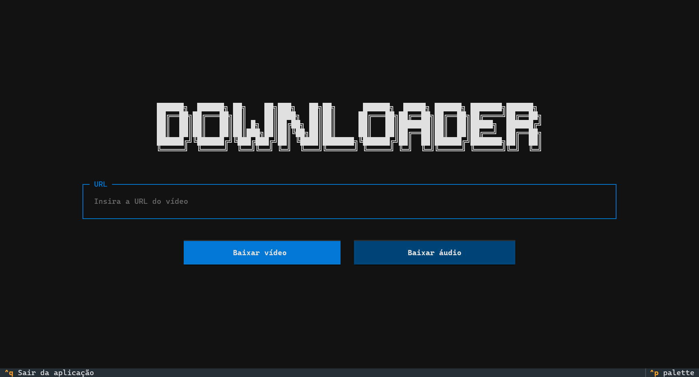

# Downloader

Aplicação para baixar vídeos ou áudios do **YouTube**. Baixe o executável [Downloader](./Downloader.exe)

<div align="center">
    
</div>

## Como executar

1. **Clone e acesse o repositório**

    ```bash
    git clone https://github.com/Davi-1903/Downloader.git
    cd Downloader
    ```

2. **Baixe as dependências**

    ```bash
    uv sync
    ```

3. **Inicie a aplicação**

    ```bash
    uv run main.py
    ```
